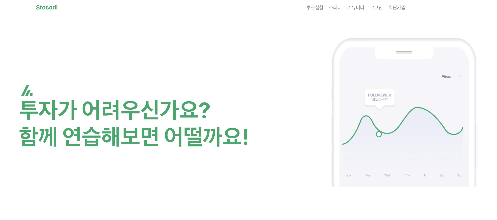

## 📈 스토코디(Stock-Codi)

- 주제 : React, Spring Boot를 활용한 주식 교육 및 모의 투자 서비스 제작
- 프로젝트명 : 스토코디(Stock-Codi)
- 프로젝트 기간 : 2023.05.13 - 2023.06.16

 

## 📈 프로젝트 참여자들

`프론트` : 여다영, 김승준

`백` : 김재홍, 신성한, 최준호

 

## 📈 사이트 기능 소개

### [메인 페이지]

 

 

### [로그인]

 

 

### [회원가입]

 

 

### [주식 교육]

 

 

### [주식 모의투자]

 

## 📈 프로젝트 후기

- 김승준

- 메인페이지, 주식투자실험 페이지 프론트를 담당하였다. 이번이 프론트엔드 첫경험 이였다.

  리엑트로 작업하였지만, 리엑트의 장점인 코드 재활용을 잘 사용하지 못해 아쉬운 느낌이 있다. 특히 여러 페이지에 걸쳐 중복되는 컴포넌트들이 존재 했지만, 복사 붙여넣기를 통해 코드 재활용을 하지 못했다. 또한 .css 파일과 함께 html 테그에 style = {} 형식으로 스타일을 주는 방법을 사용했는데 너무 섞인것 같아서 아쉽다.

  백엔드와 통신을 axios 모듈을 사용하여 진행했는데, 비동기로 처리하는 부분이 까다로웠다. 또한 자바스크립트 문법이 너무 괴랄해서 (특히 promise) 힘들었다. 처음 하는 프론트엔드 작업이였지만, 컴포넌트 하나 하나 직접 만들어서 구현을 하였고, 나도 프론트 할 수 있구나를 느꼈다. 그런데, 다시는 하기 싫다.

 

- 김재홍

- 포트폴리오와 주식거래 백엔드를 담당하였다.

  이번 학기에 처음으로 자바스프링을 공부하게 되어서 호기롭게 백엔드에 도전했는데,

  생각보다 작업해야하는 기능들이 너무 많았다. 엔티티의 연관관계 맵핑하고, 그 정보들을 자동으로 가져오는 것에 대한 이해가 잘 되지 않았으며, DB의 필드와 엔티티의 필드들을 다르게 제어하는 게 어려웠다.

  이번 프로젝트에서에서 GPT의 도움을 많이 받았다. 모르는 것을 GPT가 알려주기도 하고, GPT가 알려준 것 중 모르겠는 것들을 Google에서 찾아서 공부하는 등 시간대비 효율적인 작업이 가능했다. 그러나 이번 학기가 끝나면 만들었던 코드들을 조금 더 깊게 이해하는 시간이 필요할 것 같다.

  이번에 처음으로 JSON으로 통신도 해보고, 테스팅도 해보고, 배포도 해보는 등

  처음으로 프로젝트 다운 프로젝트를 해보게 되어 정말 기분이 좋다.

 

- 신성한

- 컨텐츠 생성 및 관리 백엔드 개발을 담당하였다.

  데이터베이스를 이용한 간단한 조회 및 생성하는 기능은 구현해 본 경험이 있지만 웹 서비스 구현에 있어 다양한 기능을 설계하고 이를 웹페이지와 연결해 본 적은 처음이었기 때문에 처음엔 막막했지만 문제를 해결해나가며 뿌듯함과 재미를 느낄 수 있었다. 특히 다이어그램 작성, 디자인 패턴 등 시스템 개발에 직접적으로 사용되는 Software Engineering 기법을 적용하고 그대로 시스템을 만들어보며 개발이 이루어지는 체계적인 방식을 경험해 볼 수 있었다.

  다만 다양한 현실적 한계로 인해 최초 계획한 기능을 모두 구현하지 못하였고 Spring Boot 및 Git 사용에 대한 미숙한 점이 있어 유연한 개발을 진행하지 못 한 점이 아쉬웠다.

  다음에는 Stocodi 개발 경험을 바탕으로 새롭게 배운 부분을 적극적으로 응용하고 아쉬웠던 부분을 보완하여 더 완벽한 결과물을 도출하고 싶다.

 

- 여다영

- 메인페이지, 로그인/회원가입, 컨텐츠 생성/조회 페이지 프론트를 담당하였다.

  리엑트로 작업하였지만, 리엑트 답지 못하게 html/css에 치중하여 작업을 한 것 같아 아쉽다. 중복되는 컴포넌트들을 따로 정의하여 이를 사용하도록 프로그램을 개선해보고 싶다.

  가장 흥미로웠던 부분은 백엔드와의 통신이었던 것 같다. fetch 방식으로 json 형태로 데이터를 바꾸어 통신하였다.

  로그인/회원가입 부분에서는 데이터가 자꾸 null로 전송되었는데, 오류를 제대로 처리하지 못하면 이러한 현상이 발생할 수 있다는 것을 알았다. 컨텐츠 부분에서는 데이터베이스에 데이터가 정상적으로 들어가는데 오류가 발생하였다. 프론트에서는 성공 시 메세지를 요청받고 있지만, 백엔드에서는 성공 시 메세지를 json형식으로 보내고 있지 않아서 뜨는 오류였다. 시간이 없어 컨텐츠 부분은 유튜브 api를 활용하도록 바꾸었는데 추후에 동영상 통신도 한번 해보고싶다.

 

- 최준호

- 백엔드 개발과 서버 배포를 보조를 담당하였다.

  Spring Boot를 사용한 프로젝트는 처음이어서 오류를 찾고 원하는 기능을 개발하는데 시간이 오래걸렸던 것 같다.

  또한 데이터 베이스에 관한 지식이 많지 않아서 설계나 구현에 관한 내용을 능숙하게 진행하지 못한 것 같아서 아쉽다. 다음 학기에 데이터베이스 수업을 통해서 지식을 얻고 해당 프로젝트를 다시 보완해보고 싶은 마음도 있다.

  프로젝트 전체적으로 시간이 촉박하여 주요 기능만 구현했던 점이 많이 아쉽다. 다른 수업, 일정 상관없이 프로젝트에만 몰두할 수 있었으면 어땠을까라는 생각도 들었다. 하지만 그럼에도 수업의 목적에 맞게 설계란 어떤 것인지 생각해보고 프로젝트와 연결지을 수 있었다는 점이 도움되었다.
